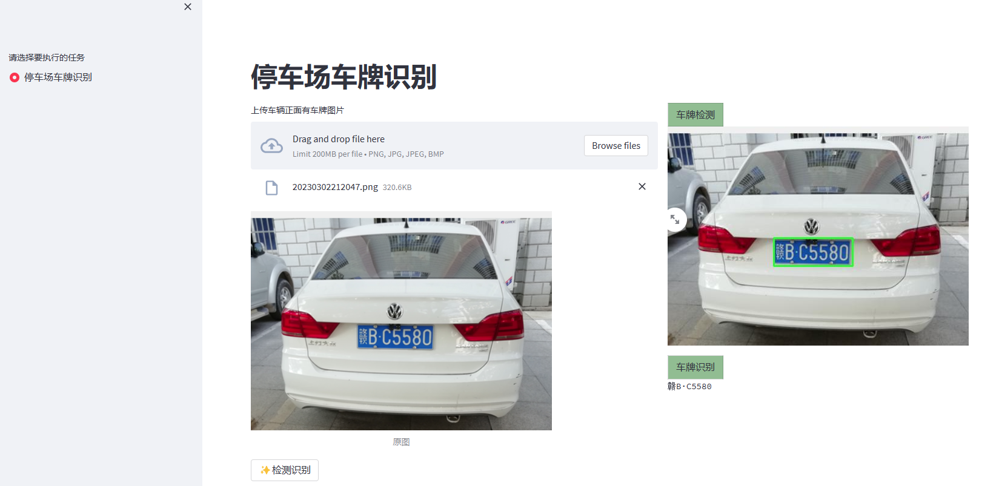
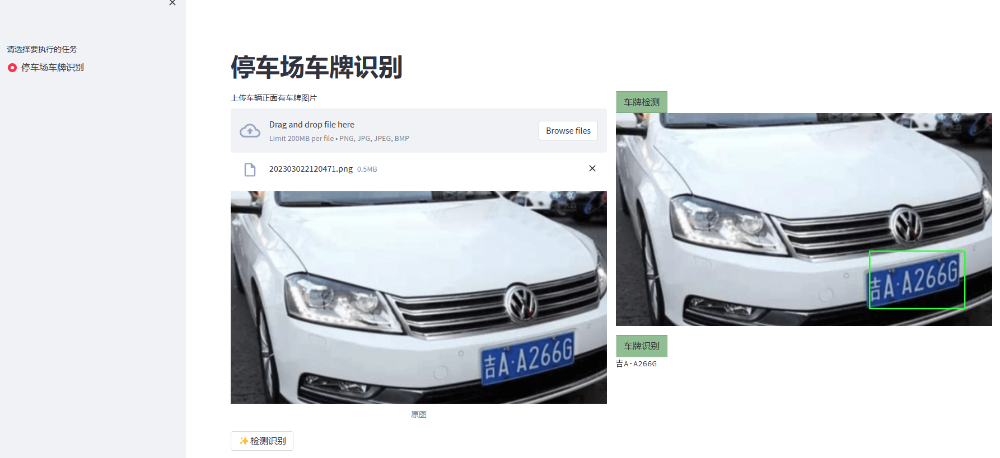
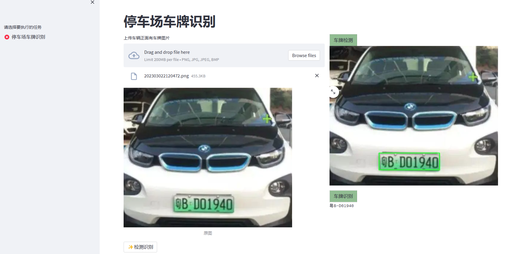

### 车牌识别（vehicle license plate recognition)
车牌识别系统：

    1.利用yolo5进行车牌检测
    2.利用paddleocr进行车牌识别
    
项目结构：
```
|-- model # 包括ocr与检测模型
|-- paddleocr # paddleocr源码
|-- src
    -- model_path.py # 模型路径，可自行更改
    -- ui.py # 前端用于显示检测和识别结果
    -- vehicle_license_plate_detection.py # 车牌检测
    -- vehicle_license_plate_ocr.py # 车牌识别
    -- vehicle_service.py # 后端服务
```

### 分别启动车牌识别后端服务和前端服务

- uvicorn vehicle_service:app --host 0.0.0.0 --port 8000 --reload
- streamlit run ui.py --server.maxUploadSize 4

### 识别结果

<br/><br/> 
<p align="center">
  <a>
    
    
    
  </a>
</p>
<br/><br/>

### contact

1、github：https://github.com/jiangnanboy

2、博客：https://www.cnblogs.com/little-horse/

3、邮件:2229029156@qq.com

